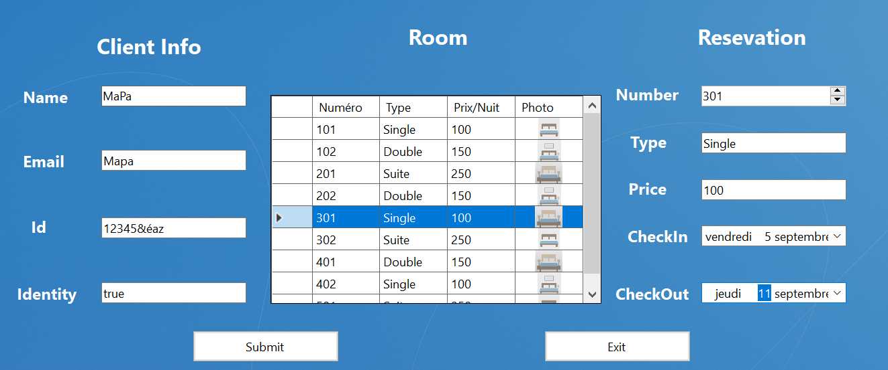
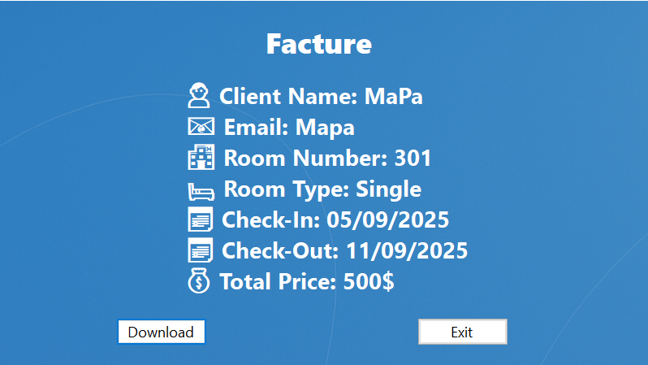

# 🏨 Hotel Booking System

**Hotel Booking System (HBS)** is a **C# Windows Forms desktop application** for managing hotel room reservations, client information, and invoice generation.  
Designed to be simple, intuitive, and visually appealing with emoji-enhanced user experience.

---

## 🌟 Features

| Feature | Description |
|---------|-------------|
| 👤 **Client Management** | Add clients with unique IDs and verify identity. |
| 🛏️ **Room Selection** | Choose Single, Double, or Suite rooms with images and prices. |
| 📅 **Reservation Management** | Select check-in/check-out dates and calculate total price automatically. |
| 💰 **Invoice Generation** | Generate and download invoices as `.txt` files. |
| ✨ **User-friendly UI** | Emoji-enhanced reservation details for clear, engaging display. |

---

## 🖼 Screenshots

| Room Selection (Form1) | Reservation Details (Form2) |
|------------------------|-----------------------------|
|  |  |  
---

## 📝 How to Use

1. Enter **Client Name** and **Email**.
2. Select **Room Number** and **Type**.
3. Choose **Check-In** and **Check-Out** dates.
4. Click **Submit** to confirm the reservation.
5. Optionally, click **Download** to save the invoice as a text file.

---

## ⚙ Requirements

- Windows OS
- **Visual Studio 2019** or later
- **.NET Framework** (Windows Forms compatible)
- Room images stored locally

---

## 💡 Notes

- Room types must be: `Single`, `Double`, or `Suite`.
- Total price is automatically calculated based on the number of nights.
- Desktop application only, designed for Windows.

---

## 👨‍💻 Author

Developed with ❤️ by **Marouan El Yassini**
